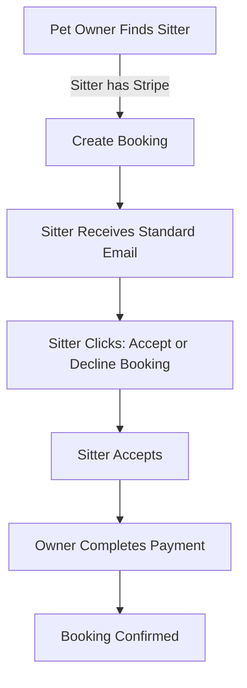
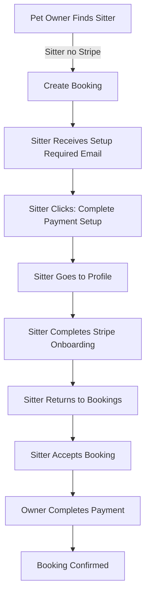

# Booking Without Stripe - Implementation Guide

## Overview
This feature allows pet owners to send booking requests to sitters who haven't completed Stripe payment setup. Sitters receive a special email notification prompting them to complete payment setup before accepting the booking.

## Changes Made

### 1. Backend Changes

#### A. `create-booking` Edge Function
**File:** `supabase/functions/create-booking/index.ts`

**Changes:**
- ✅ Removed Stripe account validation that blocked bookings
- ✅ Added check for Stripe status without blocking
- ✅ Routing logic to send different email based on Stripe status

**Before:**
```typescript
// Check if sitter has completed Stripe onboarding
if (!sitterProfile.stripe_account_id || !sitterProfile.stripe_account_enabled) {
  throw new Error('This sitter has not completed payment setup. Please choose another sitter.');
}
```

**After:**
```typescript
const hasStripeSetup = sitterProfile.stripe_account_id && sitterProfile.stripe_account_enabled;
logStep("Sitter Stripe status checked", { hasStripeSetup });

// Send appropriate notification based on Stripe status
const notificationFunction = hasStripeSetup 
  ? 'send-booking-notification' 
  : 'send-booking-notification-no-stripe';
```

#### B. New Edge Function: `send-booking-notification-no-stripe`
**File:** `supabase/functions/send-booking-notification-no-stripe/index.ts`

**Purpose:** Send booking notification to sitters WITHOUT Stripe setup

**Key Features:**
- 🎯 Clear "Payment Setup Required" section
- 📧 Enhanced subject line with "Action Required"
- 🔗 CTA links to profile page (where Stripe setup lives)
- 📋 Step-by-step instructions
- 💡 Help section with support contact

**Email Sections:**
1. Booking details table
2. Payment setup required alert (prominent yellow box)
3. Why Stripe explanation
4. Primary CTA: "Complete Payment Setup & Accept Booking"
5. "What happens next" checklist
6. Safety warning
7. Help section

#### C. Test Edge Function: `test-booking-emails`
**File:** `supabase/functions/test-booking-emails/index.ts`

**Purpose:** Automated testing for both email types

**Tests:**
1. Send notification WITH Stripe
2. Send notification WITHOUT Stripe
3. Email content verification

### 2. Frontend Changes

#### `SitterProfile.tsx`
**File:** `src/pages/SitterProfile.tsx`

**Changes:**
- ✅ Removed alert blocking bookings for sitters without Stripe
- ✅ Removed Stripe check from booking form visibility
- ✅ Pet owners can now book any verified sitter

**Before:**
```typescript
{profile?.role === 'pet_owner' && !sitterStripeEnabled && (
  <Alert>
    <AlertDescription>
      This sitter is currently setting up their payment account and cannot accept bookings yet.
    </AlertDescription>
  </Alert>
)}

{profile?.role === 'pet_owner' && sitterStripeEnabled && (
  <BookingAccordion />
)}
```

**After:**
```typescript
{profile?.role === 'pet_owner' && (
  <BookingAccordion />
)}
```

#### `FindSitters.tsx`
**File:** `src/pages/FindSitters.tsx`

**Changes:**
- ✅ Changed filter from `stripe_account_enabled: true` to just `is_verified: true`
- ✅ All verified sitters now appear in search results

## User Flows

### Flow 1: Booking Sitter WITH Stripe Setup



### Flow 2: Booking Sitter WITHOUT Stripe Setup



## Email Templates

### Standard Email (With Stripe)
```
Subject: New Booking Request - BK-ABC123

- Booking details
- "Accept or Decline Booking" button → /bookings
- Safety warning
- Standard footer
```

### Setup Required Email (Without Stripe)
```
Subject: 🎉 New Booking Request - Action Required - BK-ABC123

- Booking details
- ⚡ PAYMENT SETUP REQUIRED section
  - Why Stripe is needed
  - Security benefits
- "Complete Payment Setup & Accept Booking" button → /profile
- What happens next (5-step checklist)
- Safety warning
- 💡 Help section
- Footer
```

## Testing Instructions

### Automated Tests

1. **Run the test suite:**
```bash
# Using curl
curl -X POST https://qermxzepyzbenemcordv.supabase.co/functions/v1/test-booking-emails \
  -H "apikey: YOUR_ANON_KEY"

# Or using Supabase client
supabase.functions.invoke('test-booking-emails')
```

2. **Check results:**
   - All 3 tests should pass
   - Check `test@ziggysitters.com` for both emails

### Manual Tests

#### Test Case 1: Book Sitter Without Stripe
**Setup:**
- Find sitter with `stripe_account_enabled: false`
- Log in as pet owner

**Steps:**
1. Navigate to sitter profile
2. Fill booking form
3. Submit booking request

**Expected:**
- ✅ Booking created successfully
- ✅ No error about payment setup
- ✅ Sitter receives email with "Complete Payment Setup" CTA
- ✅ Email links to `/profile`

#### Test Case 2: Book Sitter With Stripe
**Setup:**
- Find sitter with `stripe_account_enabled: true`
- Log in as pet owner

**Steps:**
1. Navigate to sitter profile
2. Fill booking form
3. Submit booking request

**Expected:**
- ✅ Booking created successfully
- ✅ Sitter receives standard email
- ✅ Email has "Accept or Decline" CTA
- ✅ Email links to `/bookings`

#### Test Case 3: Sitter Completes Setup After Booking
**Setup:**
- Sitter has pending booking
- Sitter hasn't completed Stripe

**Steps:**
1. Sitter clicks email link to profile
2. Complete Stripe onboarding
3. Navigate to bookings
4. Accept booking

**Expected:**
- ✅ Stripe setup completes successfully
- ✅ Booking appears in bookings list
- ✅ Sitter can accept booking
- ✅ Owner can complete payment

### Edge Cases to Test

1. **Email Delivery Failure**
   - Booking should still create
   - Error logged but not blocking
   - Admin receives notification

2. **Sitter Without Email**
   - Booking creates
   - Email send fails gracefully
   - Sitter can still see booking in dashboard

3. **Multiple Pending Bookings**
   - Sitter receives email for each
   - One Stripe setup enables all
   - All emails have setup prompt

## Database Impact

### No Schema Changes Required
This feature works with existing tables:
- `profiles` (uses existing `stripe_account_enabled` field)
- `bookings` (no changes)

### Query Changes

**FindSitters Query:**
```typescript
// Before
.eq('stripe_account_enabled', true)

// After  
.eq('is_verified', true)
```

## Monitoring & Analytics

### Key Metrics to Track

1. **Booking Metrics:**
   - Bookings to sitters without Stripe (%)
   - Conversion rate: Email → Stripe completion
   - Time to Stripe completion after booking

2. **Email Metrics:**
   - Email delivery rate
   - Open rate (both email types)
   - Click-through rate on CTAs

3. **User Behavior:**
   - % of sitters completing Stripe after first booking
   - Average time to complete Stripe setup
   - Booking acceptance rate (with vs without Stripe)

### Logs to Monitor

```
[CREATE-BOOKING] Sitter Stripe status checked - {"hasStripeSetup": false}
[CREATE-BOOKING] Booking notification email sent to sitter (send-booking-notification-no-stripe)
```

## Rollback Plan

If issues arise, revert by:

1. **Restore Stripe requirement in create-booking:**
```typescript
if (!sitterProfile.stripe_account_id || !sitterProfile.stripe_account_enabled) {
  throw new Error('This sitter has not completed payment setup.');
}
```

2. **Restore FindSitters filter:**
```typescript
.eq('stripe_account_enabled', true)
```

3. **Restore SitterProfile alert:**
```typescript
{!sitterStripeEnabled && (
  <Alert>Sitter cannot accept bookings yet.</Alert>
)}
```

## Future Enhancements

1. **Email Reminders:**
   - Send follow-up if Stripe not completed in 24h
   - Progressive urgency in messaging

2. **In-App Notifications:**
   - Dashboard banner for pending Stripe setup
   - Badge count on profile menu item

3. **Analytics Dashboard:**
   - Track setup conversion funnel
   - A/B test email variations
   - Optimize CTA placement

4. **Personalization:**
   - Include potential earnings in subject
   - Show number of pending bookings
   - Add urgency based on booking dates

5. **Mobile App Deep Links:**
   - Link directly to Stripe setup in app
   - Push notifications alongside emails

## Security Considerations

✅ **Maintained:**
- Sitters still can't accept without Stripe
- Payment still gated on Stripe setup
- No changes to payment flow
- All existing RLS policies intact

✅ **Enhanced:**
- More flexible onboarding
- Better user communication
- Clearer setup expectations

## Support Resources

**For Sitters:**
- Support email: support@ziggysitters.com
- Stripe setup guide: /help/stripe-setup
- FAQ: /faq#payment-setup

**For Pet Owners:**
- Why bookings pending: /help/pending-bookings
- Sitter verification: /help/verification
